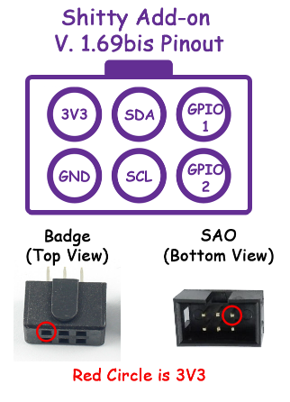

# Add-ons Overview

The badge implements the [Shitty Add-on (SAO) v1.69BIS standard](https://hackaday.com/2019/03/20/introducing-the-shitty-add-on-v1-69bis-standard/), which defines a 6-pin connector with power supply pins, I2C bus and two extra general-purpose pins:

| Pin   | Description                                   |
| ----- | --------------------------------------------- |
| 3.3V  | Positive power supply                         |
| GND   | Ground                                        |
| SCL   | I2C Bus Clock                                 |
| SDA   | I2C Bus Data                                  |
| GPIO1 | General-purpose pin with Analog input support |
| GPIO2 | General-purpose pin with Analog input support |

The pin names are printed on the back of the badge. You can also consult the following diagram:

Each add-on also contain a 128 or 256-byte EEPROM with an [Add-on ID descriptor](addon-id).

## Available Add-ons

The following add-ons where created by the badge team and distributed during the conference. Documentation is only available for the most popular add-ons:

- [Floppy Disk](floppy)
- Peacock
- Speaker
- Charlieplexing LED-Matrix
