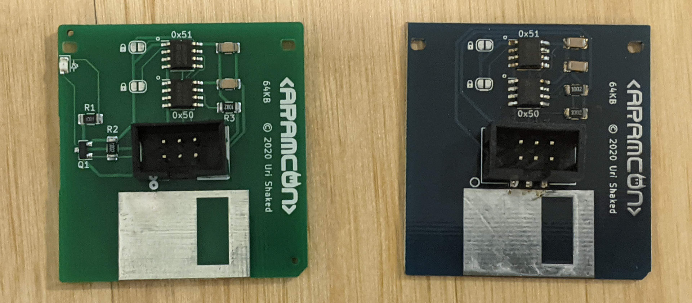

# The Floppy

Each floppy contains 64kb of storage. The floppies are formatted with the FAT filesystem, leaving about 47kb (48128 bytes) of storage available for your files.



The board has two EEPROM chips: the top chip (I2C address 0x51) has 64KB of memory and is used for data storage. The bottom (I2C address 0x50) chip has 256 bytes of memory and is used for the [Add-on ID Descriptor](addon-id).

The green diskettes also include an LED that indicates I2C bus activity (i.e. reading from or writing to the floppy).

## Copying files to the disk

To copy files to the disk, connect your badge to your computer and open
the USB drive. Create a new `viral` directory in the root of the Badge's drive,
and copy your files there.

Then, attach a black floppy to your badge. The [floppy driver](https://github.com/aramcon-badge/aramcon-firmware/blob/master/drivers/floppy.py#L96) will automatically copy all the files (but not subdirectories) to the floppy disk. You won't see any indication on the screen, so it's recommended to open the [Python REPL](../badge/repl) and observe the debug prints from the floppy driver.

When you insert the floppy disk to another badge, it will mount the floppy filesytem under `/floppy`, and then
execute `/floppy/main.py` if it exists. If you want to test this on your own badge, make sure to delete (or rename) `/viral` first, otherwise the driver will just copy the files to the floppy again instead of executing its contents.

## Write protect

You can apply write protection to a floppy by soldering the two write-protect bridges on the board:


## Python snippets

These snippets are useful for working with floppy disks from the [repl](../badge/repl):

### Formatting a floppy

To format a floppy, use the `initfloppy()` function. The first argument is the FAT volume label of the floppy.

```python
from tools.initfloppy import initfloppy
initfloppy('ARAM_FLOPPY')
```

The process of formatting a single floppy takes about half a minute.

### Mounting a floppy

Mounts the floppy filesystem in read-write mode on `/floppy`:

```python
from drivers.floppy import mountfloppy
mountfloppy()
```

### Copying files from the floppy to the badge

You can use the copy floppy package to copy files from a floppy to your badge. Note that it will only work if the badge USB drive is not attached to the computer - eject (or unmount it) before trying to copy files into your badge.

The `copyfloppy()` function will display a progress bar on your badge screen while it's copying the files. This is useful for app installer scripts.

Copy all the files (excluding subdirectories) to `/apps/cool-app`:

```python
from tools.copyfloppy import copyfloppy
copyfloppy('/apps/cool-app')
```

Copy only "foo.py" and "bar.txt" to `/apps/magniv`, and display "Installing app..." message (instead of the default "Copying files..." prompt):

```python
from tools.copyfloppy import copyfloppy
copyfloppy("/apps/magniv", ["foo.py", "bar.txt"], "Installing app...")
```

### Floppy addon metadata

The floppy drives stores 4 bytes of metadata in the driver data buffer of the [binary Add-on ID descriptor](addon-id):

| Offset | Description                                      |
| ------ | ------------------------------------------------ |
| 0      | Flags. Reserved and must be 0                    |
| 1      | Data EEPROM address. Usually 0x51                |
| 2      | EEPROM memory size exponent (e.g. 16 for 64kbit) |
| 3      | EEPROM page size exponent (e.g. 7 for 128 bytes) |

## Schematic diagram


