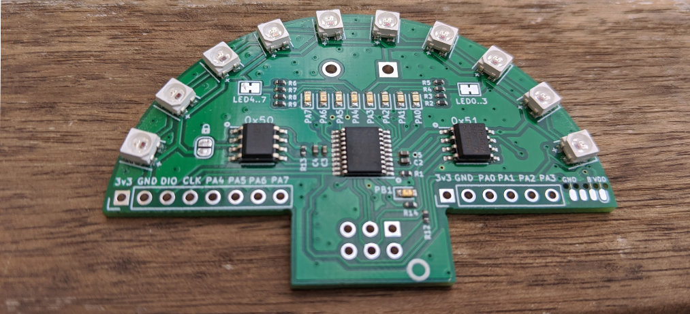
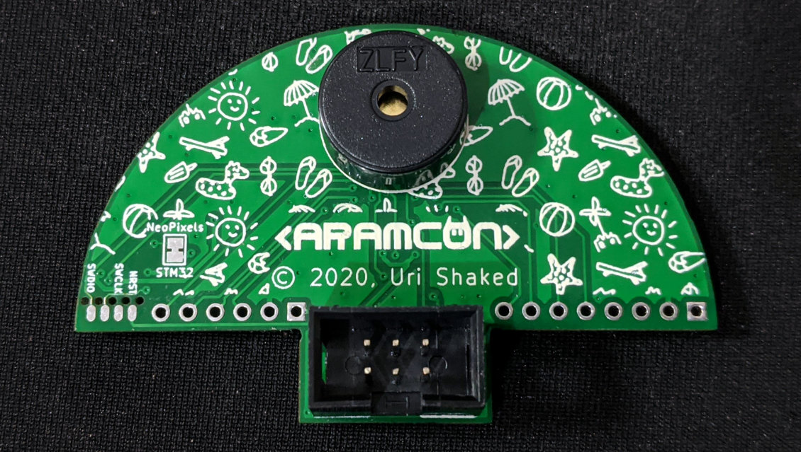
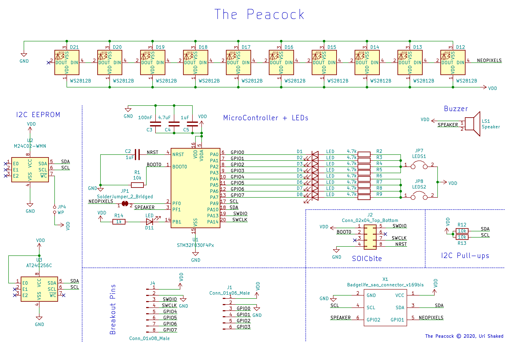

# The Peacock

The peacock is a prototyping platform for add-ons with RGB LEDs, STM32F030 microcontroller, 32KByte EEPROM, and a pizeo buzzer:



and the back side:



## Hardware features

- STM32F030F4 ARM Cortex®-M0 CPU with 16KB of Flash memory, 4KB of SRAM connected to the I2C bus
- 32KB (256kbit) I2C EEPROM for data storage (address 0x51)
- 256 byte I2C EEPROM for [Add-on ID descriptor](addon-id)
- 10 WS2812 RGB LEDs connected to GPIO1 pin
- Piezo buzzer connected to GPIO2 pin
- 9 x Blue LED controlled by the STM32 microprocessor
- Break out pins for 8 of the STM32 GPIO pins
- SOICbite programming interface

## Schematic diagram



## Sample code

The following code snippet configures the 10 RGB LEDs (neopixels) and cycles them through 4 different colors: red, green, blue, and purple.

```python
import neopixel
import board
import time

colors = [
  (80, 0, 0),  # Red
  (0, 80, 0),  # Green
  (0, 0, 80),  # Blue
  (80, 0, 80), # Purple
]

pixels = neopixel.NeoPixel(board.GPIO1, 10)
for color in colors:
  for i in range(10):
    pixels[i] = color
    time.sleep(0.1)
```
