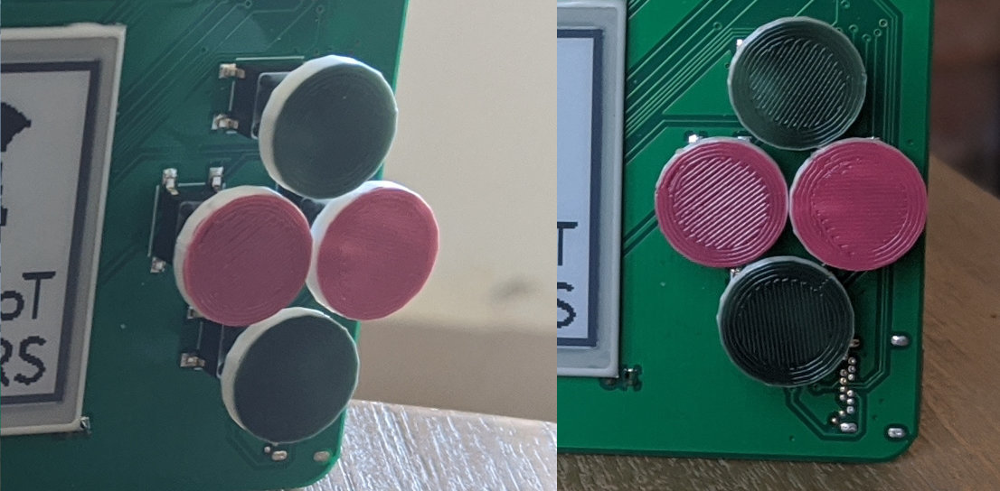

# 3D printable parts

You can find some 3d-printable modules in the [3d-printable parts](https://github.com/aramcon-badge/3d-printable-parts) repository.

## Button caps

[Download the model file](https://github.com/aramcon-badge/3d-printable-parts/blob/master/button-cap.stl). Painted with nail polish:

