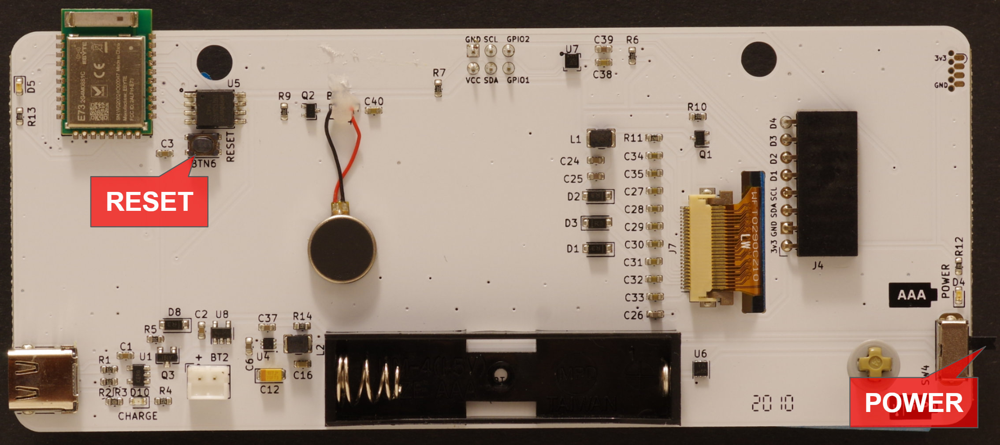

## Important notes

The USB-C connector only works in one orientation. The other orientation will still power the badge, but the data pins (USB Drive) won't be connected.

The power pin markings (AAA and LiPo/USB) are reversed.

## Setting your name

The recommended way to set your name is creating a 296x128 monochrome (2-bit) bitmap and save it as "nametag.bmp" in the root folder of your badge drive.

## Reset button

There's a handy reset button at the back of the board:

