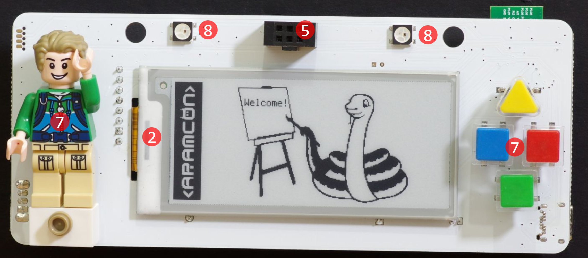

## Hardware overview

The badge is powered a powerful ARM Cortex-M4 Processor with 1MB of internal Flash memory (which holds the CircuitPython operating system), 16MB of external Flash memory (where your Python code and files are stored), and built-in Bluetooth Low Energy 5 and ZigBee Radio.

The hardware includes a 296x128 E-Paper display, 3-axis accelerometer, two RGB smart LEDs (NeoPixel/WS2812), a vibration motor, 5 input buttons, a USB-C connector, and a LiPo battery recharging circuit.

## Extension ports

The badge includes two hardware extension ports. They both include I2C connectivity:

- [Front port with 6 pins](../addons/addons): VCC, GND, SCL, SDA, GPIO1, GPIO2.
- Back port with 8 pins: VCC, GND, SCL, SDA, D1, D2, D3, D4.

The GPIO1/2 and D1/2/3/4 pins are digital GPIO pins that can be used for any purpose.
GPIO1/2 can also be used as analog inputs.

## Hardware details

1. [nRF52840](https://infocenter.nordicsemi.com/pdf/nRF52840_OPS_v0.5.pdf) 64MHz ARM Cortex-M4F64 CPU with 1MB flash, 256KB ram, USB, Bluetooth Low Energy 5, Thread, and Zigbee
2. [GDEW029T5](http://www.e-paper-display.com/products_detail/productId=347.html) 2.9 inch e-paper glass display
3. [LIS2DH12](https://www.st.com/resource/en/datasheet/lis2dh12.pdf) I²C Accelerometer
4. [W25Q128JV](https://www.winbond.com/resource-files/w25q128jv%20revf%2003272018%20plus.pdf) 128MBit (16MB) Serial Flash
5. [Shitty Add-On V1.69BIS Connector](https://hackaday.com/2019/03/20/introducing-the-shitty-add-on-v1-69bis-standard/)
6. 8-Pin extension slot (on the back) with I2C interface
7. 5 x 6mm Push Buttons
8. 2 x [WS2812B](https://cdn-shop.adafruit.com/datasheets/WS2812B.pdf) "NeoPixel" Addressable RGB LEDs
9. 1 x Green Indication LED (on the back)
10. Reset Button
11. Vibration motor
12. LiPo battery connector with built-in charger (for 500mA-1000mA battery)
13. Power switch
14. [SOICbite](https://github.com/SimonMerrett/SOICbite) SWD debug port

## Pinout

Usually, you shouldn't care about this, as it's abstracted by the firmware code. But in case you are still interested, here is the hardware pinout:

| Pin   | Component          | Function |
| ----- | ------------------ | -------- |
| P0.00 | Extension Slot     | D2 Pin   |
| P0.01 | E-Paper            | SCLK     |
| P0.02 | Pushbutton         | Down     |
| P0.03 | Accelerometer, SAO | SDA      |
| P0.04 | SAO                | GPIO1    |
| P0.05 | SAO                | GPIO2    |
| P0.06 | E-Paper            | RESET    |
| P0.07 | E-Paper            | CS       |
| P0.08 | WS2812 Neopixels   | DATA     |
| P0.10 | Pushbutton         | Action   |
| P0.12 | E-Paper            | D/C      |
| P0.13 | Extension Slot     | D3 Pin   |
| P0.15 | Extension Slot     | D1 Pin   |
| P0.17 | Vibrator           | Vibrate  |
| P0.20 | Serial Flash       | SO/IO1   |
| P0.22 | Serial Flash       | SI/IO0   |
| P0.24 | Extension Slot     | D4 Pin   |
| P0.26 | E-Paper            | BUSY     |
| P0.28 | Accelerometer, SAO | SCL      |
| P0.29 | Pushbutton         | Left     |
| P0.30 | Battery Voltage    | Analog   |
| P0.31 | Pushbutton         | Top      |
| P1.00 | Serial Flash       | SCK      |
| P1.02 | Serial Flash       | CS       |
| P1.04 | Serial Flash       | WP/IO2   |
| P1.06 | Serial Flash       | HOLD/IO3 |
| P1.09 | E-Paper            | MISO     |
| P1.10 | E-Paper            | MOSI     |
| P1.11 | Red LED            | Cathode  |
| P1.13 | Pushbutton         | Right    |

## Schematic and KiCad EDA files

- [Download badge schematic (PDF)](/files/aramcon2-badge-schematic.pdf)
- [Badge KiCad EDA files](https://github.com/aramcon-badge/aramcon-hardware/tree/master/pcbv2)

## Technical drawing

