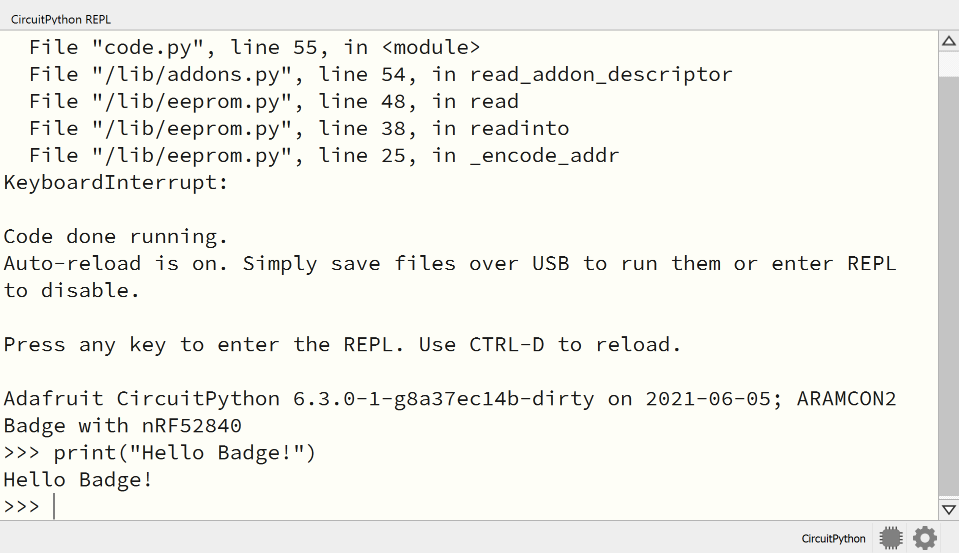

## Serial Terminal Software

You'll need a Serial Terminal software. There are many options:

1. [Mu Python Editor](https://codewith.mu/) - Windows / Mac OSX / Linux
2. [Thonny Python IDE](https://thonny.org/) - Windows / Mac OSX / Linux
3. [CircuitPython Editor](https://play.google.com/store/apps/details?id=com.foamyguy.circuitpythoneditor) - Android
4. [Putty](https://www.putty.org/) - Windows
5. minicom / picocom / screen - Linux / Mac OSX

## Starting the REPL

Connect the badge to your computer using USB-C. Make sure that you computer recognized your device as a serial port (COM port on Windows or /dev/\*tty\* on Linux/macOS). If your computer doesn't recognize the device, try flipping the orientation of the USB-C cable.

Open your terminal software and connect to the Serial port. If the terminal software asks for the baud rate, use 115200.

When connected, you'll see the output from the code (e.g. any `print()` statements). 

To get to the REPL, press Ctrl+C (keybord interrupt). This will stop the firmware code and drop you to the Python REPL. You may need to try it several times.

If you want to quit the REPL and return to the firmware code, pressed Ctrl+D. It'll also soft-reset the badge, starting the firmware code from a clean state.

