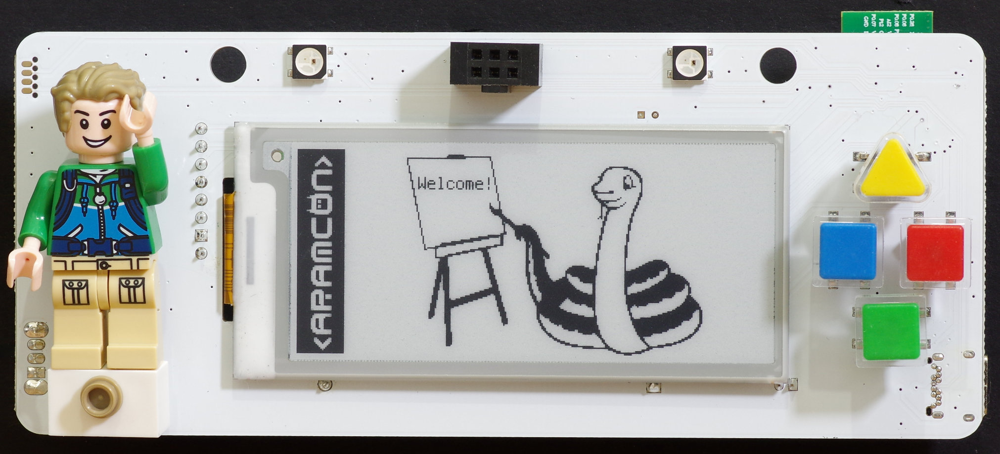

# Welcome!

Enjoy your new ARAMCON badge!

Here are some things you might want to know:

- [Getting Started](badge/getting-started)
- [Python REPL](badge/repl)
- [Hardware Features, pinout and schematics](badge/hardware-features)
- [Programming Guide](programming/getting-started)
- [Floppy Add-on](addons/floppy)

## Source code links

- [Firmware source code (Python)](https://github.com/aramcon-badge/aramcon-firmware)
- [Hello world sample app](https://github.com/aramcon-badge/badge-examples/tree/master/helloworld)
- [Rock-paper-scissors game (two players, over Bluetooth)](https://github.com/aramcon-badge/aramcon-firmware/pull/1/files)
- [Docs source code](https://github.com/aramcon-badge/badge-docs)